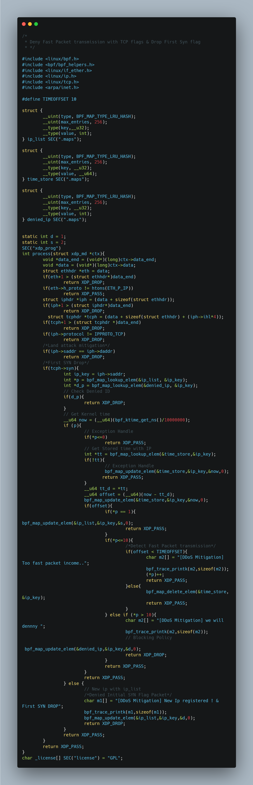
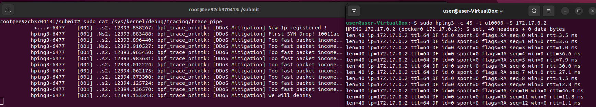

# 🚀  DDoS Mitigation using XDP #1
---
## Introduction
In this document, we present our XDP-based program designed to mitigate DDoS attacks by By detecting the time intervals between incoming packets. 

The primary defense strategies implemented in the program include: 
1. **Land Attack Mitigation**: This involves dropping TCP packets with the SYN flag set to prevent Land attacks. 
2. **Rate Limiting by IP Address**: By monitoring the time intervals between incoming packets from each IP, the program blocks IPs that send packets too rapidly, thereby mitigating potential DDoS attacks.
3. **First SYN Drop** 
## XDP Program code

## Result

