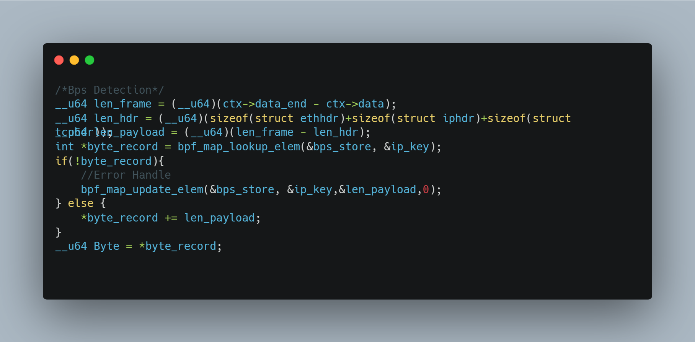
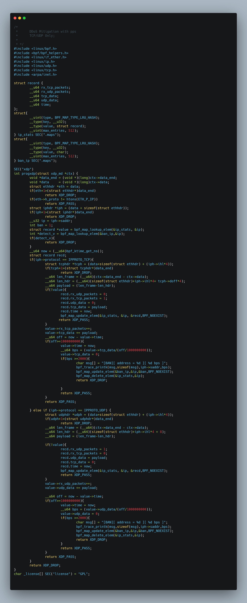
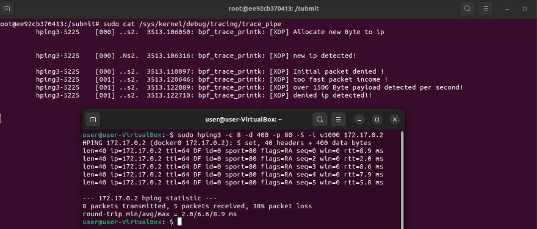
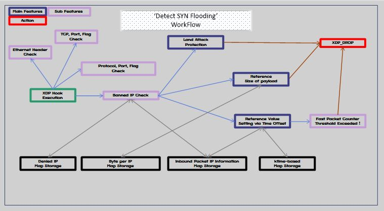

# 🚀  DDoS Mitigation using XDP #2
---
## Introduction
This document presents a concise code snippet to mitigate resource overload attacks based on BPS, specifically targeting scenarios where a large number of packets with excessive size are received in a short period.

Included below are a short code snippet, results, and a program flowchart.
## Code snippet

## Result

## Overall flowchart

