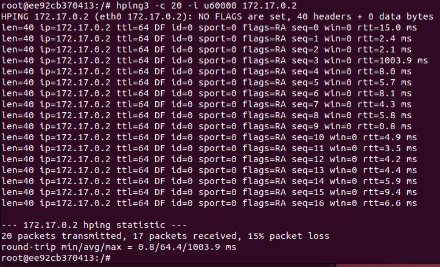
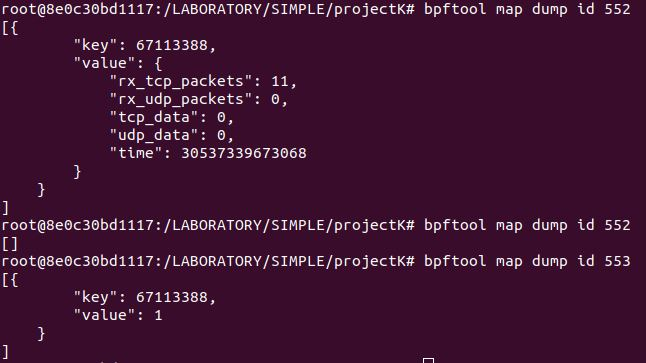

# 🚀  DDoS 방어 코드 - PPS
---
## Introduction

'Packet Per Second' 를 활용하여 특정 아이피에서 비롯되는 과도한 트래픽 공격을 막는 코드를 작성했습니다. 1초를 기준으로 시간 데이터를 저장하고 PPS 를 계산하여 지정된 임계치를 넘으면, 
해당 IP로부터 유입되는 트래픽을 차단합니다.

- 아래의 첫 번째 사진은 소스 코드를, 두 번째 사진은 결과에 대한 내용을 제시하고 있습니다. 
- 두 번째 사진에서 map id 553 은 차단한 ip 정보를 포함하고 있습니다.

## Code

## Result

