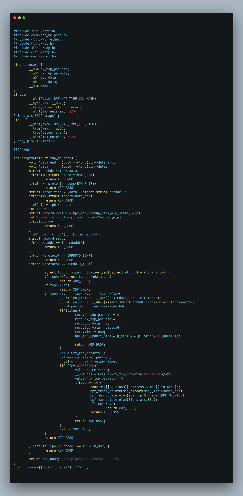

# 🚀  DDoS 방어 코드 - 종합 솔루션 업데이트
---
## Introduction

'DDoS 공격 종류 및 대응 방안' 파일을 바탕으로 개발한 솔루션들을 종합한 코드입니다. 

- 프로토콜 UDP,ICMP 거부
- Land Attack 방어
- TCP flag 공격에 대한 pps 기반 방어
- TCP RST flag 거부
- First SYN drop
## Code

## Result

