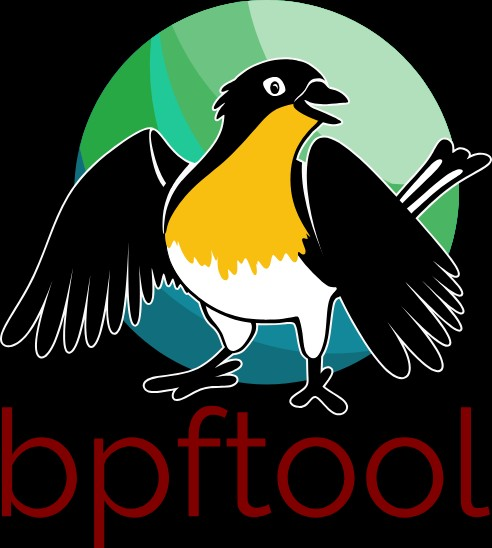
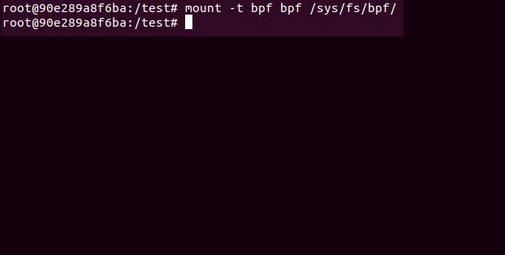
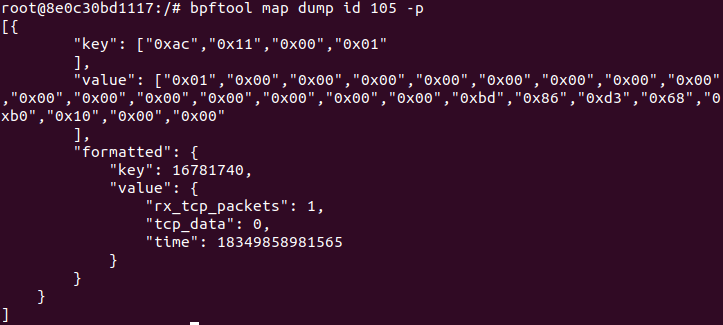
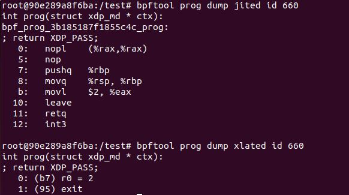
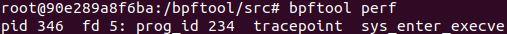
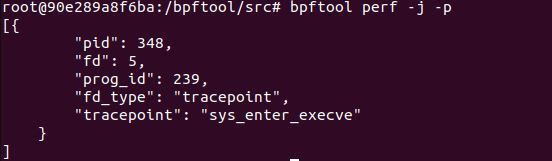
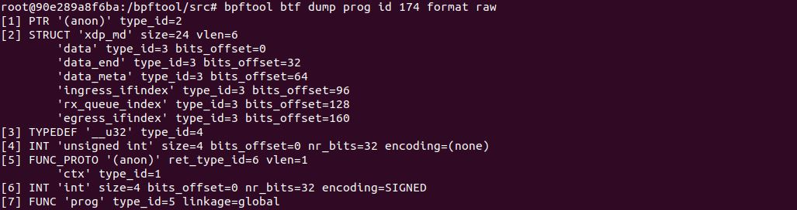
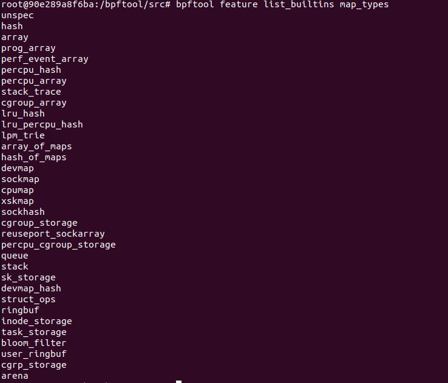
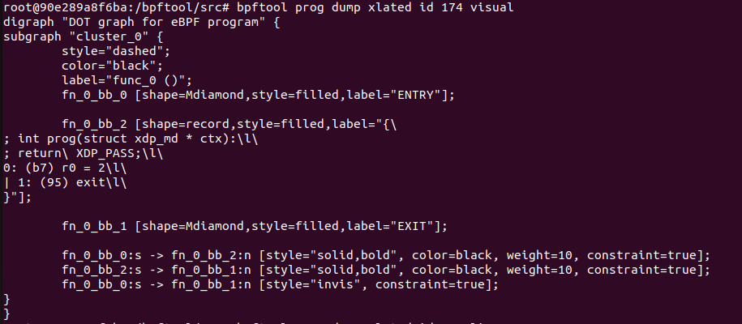
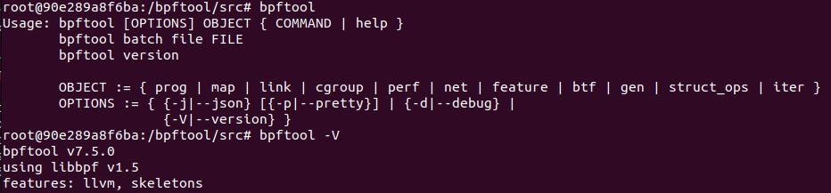

***
# Bpftool 오픈소스 가이드라인 


오픈소스 주소 : [bpftool](https://github.com/libbpf/bpftool/]

#### 프로그램 설명
다양한 BPF 프로그램에 대한 세부 정보들을 수집하며, 명령어를 통한 간단한 수정 및 설정이 가능하다.
* 사용하고 있는 커널, BPF 관련 라이브러리 버전, 실습 환경(장비)에 따라 사용할 수 있는 명령어가 제한될 수 있다.

> Github의 bpftool 공식 레포지토리에서는 기존 커널 트리에 위치한 bpftool을 기반으로 지속적인 개발 및 보수 작업을 통해 업데이트하고 있다.

#### 설치 명령어 #1 (linux-tools)

```
apt update && apt upgrade
apt install sudo
sudo apt install libbpf-dev libelf-dev zlib1g-dev cmake libbfd-dev clang llvm libcap-dev linux-tools-$(uname -r)

COMMAND : bpftool
```
#### 설치 명령어 #2 (Github)

```
apt update && apt upgrade
apt install sudo
sudo apt install libelf-dev zlib1g-dev cmake libbfd-dev clang llvm libcap-dev pkg-config
linux-tools-general

git clone --recurse-submodules https://github.com/libbpf/bpftool.git
cd /bpftool/src
make

COMMAND : ./bpftool
```
#### 오픈소스 실행 오류 핸들링 (Github)
```
Headerfile error
	vmlinux : /bpftool/src/vmlinux 으로 변경
```

#### 선택 옵션 (Github)
```
1. 다른 디렉토리에서 bpftool 사용하기
	cd /bpftool/src
	OUTPUT=/원하는/경로 make
2. Document 생성
	apt install python3-docutils man-db
	unminimize
	cd docs
	make
	man <manual>
```
#### 명령어
	bpftool [OPTIONS] OBJECT { COMMAND | help }
```
- OBJECT
	prog : (show/list/dump jited/dump xlated/pin/load/attach/detach/help)
	map : (show/list/create/update/update/lookup/getnext/delete/pin/event_pipe/help)
	link : (show/list/pin/detach/help)
	cgroup : (show/list/attach/detach/help)
	perf : (show/list/help)
	net : (show/list/help)
	feature : (probe/help)
	btf : (show/list/dump/help)
	gen : (object/skeleton/min_core_btf/help)
	struct_ops : (show/list/dump/register/unregister/help)
	iter : (pin/help)

- OPTIONS 
	--json : json 형식의 출력
	--pretty : --json 기반, 읽을 수 있는 양식으로 출력
	--debug : 디버깅 로그 출력
	--version : 
		1. bpftool의 버전을 출력한다. 
		2. 사용 중인 libpf 버전을 출력한다. 
		3. 컴파일 옵션을 출력한다.
```
### 설명
```
1. prog
	show/list : program list 나열
	dump xlatted : 프로그램의 명령줄 확인
		옵션 중 'visual' : 함수와 코드 블럭 등을 제공하여 프로그램의 시각화 정보 출력
	dump jited : Just-In-Time 컴파일을 통해 변환된 machine code 제공
	pin : program pin
	load/loadall : program load
	attach/detach : 훅에 attach or detach
	run : 임의의 Bpf 프로그램에 입력을 주고 실행
	profile : 프로파일링
	tracelog : log 확인
		커널 내부에서 작동하는 perf 이벤트나 디버깅 로그를 유저 공간에서 확인하기 위한 용도
		> 시스템의 trace pipe 출력
2. map
	show/list : map list 나열
	create : map 생성
	dump : map 구조 및 세부 내용 확인
	update : map 최신화
	lookup : map lookup
	getnext : map 내부 key 조회
	delete : map key data 제거
	pin : map pin
	
	이하 파라미터는 Map type 에 따른 사용자 지정
	
	event_pipe[perf_event_array] : 맵 배열에 perf ring을 설치하고 기존의 ring은 제거
		bpf perf 이벤트 함수에 따른 출력 덤프
		> 파라미터 이름에서 알 수 있듯 event 에 대한 pipeline 제공
	peek[queue,stack]
	push[stack]
	pop[stack]
	enqueue[queue]
	freeze : 맵을 read only 로 변경 
3. link
	show/list : link list 나열
	pin : link pin
	detach : link detach
4. cgroup : cgroup 제어
	show/list : cgroup list 나열
	tree : CGROUP_ROUT 내부 모든 cgroup을 출력
	attach : cgroup에 프로그램 attach
	detach : cgroup에서 프로그램 detach
5. perf : 시스템 내 작동하는 tracepoint, kprobe attachment 조회
6. net : 네트워크 인터페이스에 BPF 프로그램을 부착하거나 해제
	show/list : device에 부착된 프로그램 확인
	attach : 프로그램 부착
	detach : 프로그램 해제
7. feature
	probe : 사용할 수 있는 event 등을 검색 
		dev : 지정한 장치가 사용할 수 있는 프로그램 타입, 맵 등 출력
		kernel : 내부에서 사용할 수 있는 bpf event 검색
	list_builtins : libbpf 혹은  bpf uapi를 바탕으로 인식할 수 있는 bpf 리스트를 나열
		prog_type, map_type 등등....
8. btf : BPF 프로그램 내부 구조에 대한 간단 명확한 정보 제공
	show/list : btf list 나열
	dump : 세부 내용 출력
9. gen
	object : 2개의 INPUT file을 OUTPUT file로 병합
	skeleton : BPF 프로그램에 대한 스켈레톤 코드 생성
		'>' 를 이용하여 파일에 저장하거나
		다른 파라미터가 없을 경우 지정된 이름에 따른 스켈레톤 코드 출력
	subskeleton : 기존 skeleton 생성 명령어에서 맵, 전역변수, BPF 프로그램등을 제외한 것
	min_core_btf : 외부참조가 가능한 BTF 파일을 생성할 수 있음
10. struct_ops : 등록된 struct_ops 관련 정보 제공 / 등록 및 해제 명령어 제공
	show/list : struct_ops list 나열
	dump : 세부 내용 확인
	register : 커널 서브 시스템에 등록
	unregister : 커널 서브 시스템으로부터 해제
11. iter : interator 오브젝트를 핀/언핀
	pin : iterator object pin
```
#### 실제 사용
1. Network - XDP
	
2. Map dump & --pretty
	

3.  JITed/xlated
	
4.  perf & use pretty option
	
	
5.  btf
	
6.  feature list_builtin
	
7.  dump visual	
	
 

---
# 실습 환경 - Dockerfile

```
	COMMAND
docker build -t bpftool-image .
docker run -itd --name bpftool bpftool-image
docker exec -it bpftool bash

```
> Container
	

