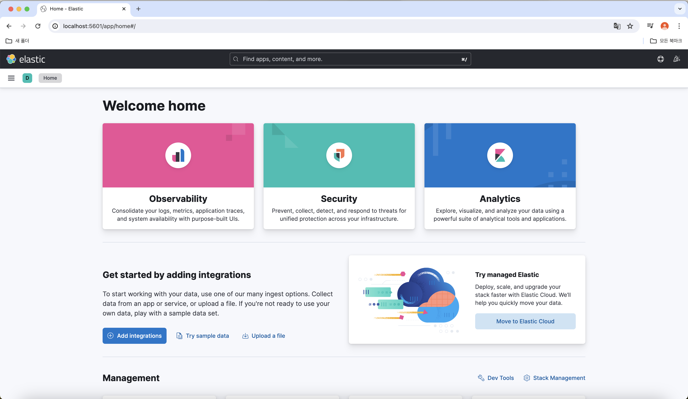
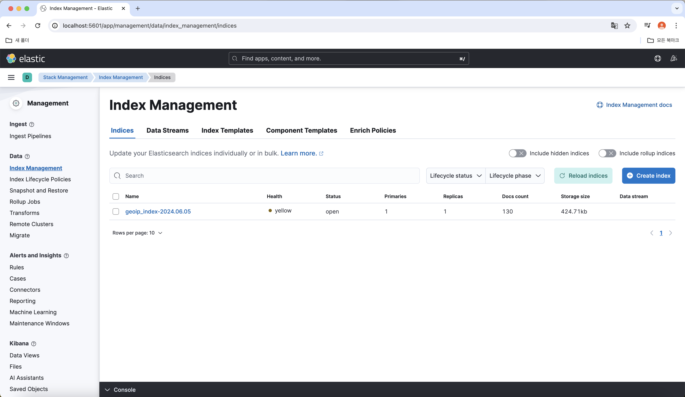
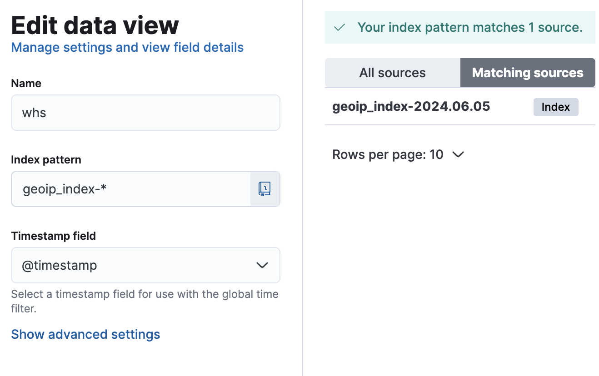

ELK Stack의 자세한 사용법 입니다.

#### **docker-compose.yml**
```
# 실행은 docker-compose up -d 밑에 설정파일들 작성하시고 실행하시면 됩니다.

version: '3.8'

services:

  elasticsearch:

    image: docker.elastic.co/elasticsearch/elasticsearch:8.13.4

    environment:

      - node.name=elasticsearch

      - discovery.type=single-node

      - TZ=Asia/Seoul

    volumes:

      - elasticsearch-data:/usr/share/elasticsearch/data

      - ./elasticsearch/config/elasticsearch.yml:/usr/share/elasticsearch/config/elasticsearch.yml

      - /etc/localtime:/etc/localtime:ro

    ports:

      - "9200:9200"

    networks:

      - elk

  

  logstash:

    image: docker.elastic.co/logstash/logstash:8.13.4

    environment:

      - TZ=Asia/Seoul

    volumes:

      - ./logstash/config/logstash.yml:/usr/share/logstash/config/logstash.yml

      - ./logstash/pipeline/logstash.conf:/usr/share/logstash/pipeline/logstash.conf

      - ./logstash/GeoLite2-City.mmdb:/usr/share/logstash/GeoLite2-City.mmdb

      - /etc/localtime:/etc/localtime:ro

    ports:

      - "5044:5044"

    networks:

      - elk

    depends_on:

      - elasticsearch

  

  kibana:

    image: docker.elastic.co/kibana/kibana:8.13.4

    environment:

      - ELASTICSEARCH_HOSTS=http://elasticsearch:9200

      - TZ=Asia/Seoul

    ports:

      - "5601:5601"

    networks:

      - elk

    depends_on:

      - elasticsearch

  

networks:

  elk:

    driver: bridge

  

volumes:

  elasticsearch-data:

    driver: local
```

GeoLite 데이터 베이스 다운 받으셔서 저 경로에 넣으시면 됩니다

GeoLite 다운로드 사이트
https://dev.maxmind.com/geoip

#### logstash 설정

**경로**

<logstash/pipeline/logstash.conf>

<logstash/config/logstash.yml>

**logstash.conf**
```
input {

  beats {

    port => 5044

  }

}

  

filter {

  if [source][ip] {

    geoip {

      source => "[source][ip]"

      target => "[source][geoip]"

      database => "/usr/share/logstash/GeoLite2-City.mmdb"

      fields => ["CITY_NAME", "CONTINENT_CODE", "COUNTRY_CODE2", "COUNTRY_NAME", "LOCATION", "POSTAL_CODE", "REGION_ISO_CODE", "REGION_NAME", "TIMEZONE"]

    }

  }

  

  if [destination][ip] {

    geoip {

      source => "[destination][ip]"

      target => "[destination][geoip]"

      database => "/usr/share/logstash/GeoLite2-City.mmdb"

      fields => ["CITY_NAME", "CONTINENT_CODE", "COUNTRY_CODE2", "COUNTRY_NAME", "LOCATION", "POSTAL_CODE", "REGION_ISO_CODE", "REGION_NAME", "TIMEZONE"]

    }

  }

}

  

output {

  elasticsearch {

    hosts => ["http://elasticsearch:9200"]

    index => "geoip_index-%{+YYYY.MM.dd}"

  }

  stdout { codec => rubydebug }

}
```

**logstash.yml**
```
http.host: 0.0.0.0

xpack.monitoring.elasticsearch.hosts: http://elasticsearch:9200

xpack.monitoring.elasticsearch.username: elastic

xpack.monitoring.enabled: false
```

#### elasticsearch 설정

**경로**

<elasticsearch/config/elasticsearch.yml>

**elasticsearch.yml**
```
# 네트워크 설정

network.host: 0.0.0.0  # 모든 네트워크 인터페이스에서 접근 가능하게 설정

# 클러스터 설정

cluster.name: "docker-cluster"

node.name: "elasticsearch"

  

# 경로 설정

path.data: /usr/share/elasticsearch/data

path.logs: /usr/share/elasticsearch/logs

  

# 보안 설정 비활성화

xpack.security.enabled: false

  

# 단일 노드 설정

discovery.type: single-node

  

ingest.geoip.downloader.enabled: true
```

#### **Kibana 설정**

**경로**

<kibana/config/kibana.yml>

**kibana.yml**
```
server.name: kibana

server.host: "0.0.0.0"

elasticsearch.hosts: [ "http://elasticsearch:9200" ]

xpack.fleet.agents.enabled: false
```

**packetbeat 설정**

**docker-compose.yml**
```
# docker-compose up -d로 간단히 packetbeat를 실행 시킬 수 있음.

  

#version: '3.8'

  

services:

  packetbeat_full:

    image: docker.elastic.co/beats/packetbeat:8.13.4

    container_name: packetbeat_full

    user: packetbeat

    volumes:

      - ./packetbeat.docker.yml:/usr/share/packetbeat/packetbeat.yml:ro

    cap_add:

      - NET_RAW

      - NET_ADMIN

    network_mode: host

    command: packetbeat -e --strict.perms=false
```

**packetbeat.docker.yml**
```
# 모니터링할 NIC 설정, any는 모든 NIC 대상

packetbeat.interfaces.device: any

  

# af_packet은 linux에서만 사용 할 수 있지만, memory-mapping을 사용해 pcap보다 빠르다

packetbeat.interfaces.type: af_packet

#packetbeat.interfaces.buffer_size_mb: 100

  

# packerbeat가 자동으로 무차별모드를 on/off할 수 있게 해주는 옵션

packetbeat.interfaces.auto_promisc_mode: true

  

# 수집할 포트(packerbeat가 지원하는 모든 프로토콜들)

packetbeat.flows:

 timeout: 30s

 period: 10s

  

protocols:

- type: icmp

  enabled: true

  

- type: dhcpv4

  ports: [67, 68]

  

- type: dns

  ports: [53]

  

- type: http

  ports: [80, 8080, 8000, 5000, 8002]

  

- type: amqp

  ports: [5672]

  

- type: cassandra

  ports: [9042]

  

- type: memcache

  ports: [11211]

  

- type: mysql

  ports: [3306,3307]

  

- type: redis

  ports: [6379]

  

- type: pgsql

  ports: [5432]

  

- type: thrift

  ports: [9090]

  

- type: tls

  ports: [443, 993, 995, 5223, 8443, 8883, 9243]

  

# # elasticsearch로 정보를 보낼 때.

#: output.elasticsearch:

#   hosts: 'localhost:9200'

#   protocol: "http"

#   username: 'elastic'

#   password: 'qwe123'

  

# logstash로 정보를 보낼 떄.

output.logstash:

  hosts: ["localhost:5044"]

  

processors:

  - add_host_metadata: ~

  - add_cloud_metadata: ~

  - add_docker_metadata: ~
```

packetbeat는 사양에 따라 패킷을 캡처하는 인터페이스를 지정하거나 캡쳐 할 특정 포트만 캡쳐하시면 됩니다.

### **사용방법**

1. 도커 파일들을 모두 실행시킵니다.
2. localhost:5601 접속합니다.
3. 왼쪽 상단바 들어가서 Development > DevTools 에 들어갑니다.
그 후 밑에 내용을 복사 및 붙여넣기를 하여 템플릿 매핑을 해줍니다.
```
PUT /_index_template/packetbeat_template
{
  "index_patterns": ["packetbeat-*"],
  "settings": {
    "number_of_shards": 1
  },
  "mappings": {
    "properties": {
      "@timestamp": {
        "type": "date"
      },
      "destination": {
        "properties": {
          "geoip": {
            "properties": {
              "location": {
                "type": "geo_point"
              }
            }
          }
        }
      },
      "source": {
        "properties": {
          "geoip": {
            "properties": {
              "location": {
                "type": "geo_point"
              }
            }
          }
        }
      }
    }
  }
}
```
4.  인덱스가 생성되었는지 확인합니다.
     Stack Management > Index Mangement로 이동합니다.
     
  이렇게 제대로 데이터가 로드되었으면 정상입니다.
  
  5.  Discover > Manage this data view 로 이동합니다.
      밑에 사진처럼 작성 후 저장합니다.
	  
	  
  6. 시각화
	  Visualize Library > Create new visualization > Lens
		  - 그래프 시각화
	  Visualize Library > Create new visualization > Maps
		  - 패킷이 출발한 위치, 도착한 위치 시각화
     
