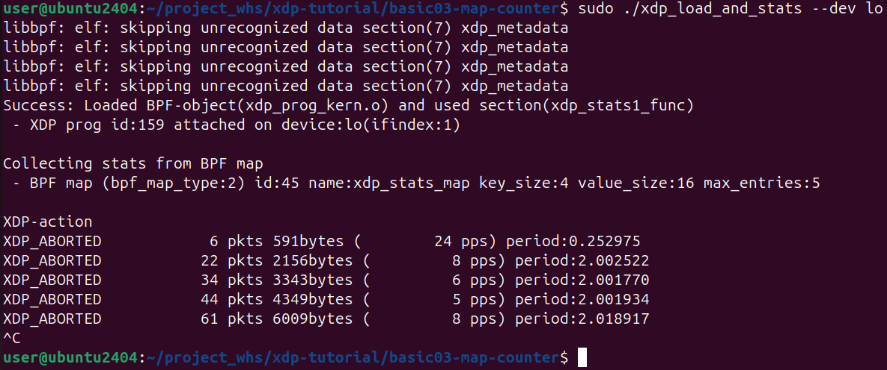

<!-- # [**XDP-Tutorial**](https://github.com/xdp-project/xdp-tutorial)
   - **설명**: eXpress Data Path의 기본적인 이해를 위한 튜토리얼 및 예제 모음.
   - **특징**: XDP의 동작 및 개발 방법에 대한 이해 촉진.
   - **장단점**:
     - **장점**: XDP 프로그래밍에 대한 학습에 유용한 자원 제공.
     - **단점**: 고급 사용자에게는 부족한 수준일 수 있음.
   - **설치 가이드**: 프로젝트의 GitHub 페이지 또는 문서를 따라 설치. -->
# XDP-Tutorial 가이드라인


xdp는 eXpress Data Path의 약자로, 위 사진에서 볼 수 있듯, 받은 패킷이 가장 먼저 거치는 과정이다.
기존의 방식인 네트워크 스택을 경유하여 패킷을 처리하게 되면, 각 Layer를 거칠때 마다, Encapsulation/Decapsulation을 하고, 이 과정에서 copy를 하여 오버헤드가 발생한다.
xdp로 패킷을 5가지 방법으로 처리할 수 있다.
- **XDP_ABORTED(0)**  : 패킷을 DROP하고, XDP program 을 종료시킨다.
- **XDP_DROP(1)**     : 패킷을 DROP한다.
- **XDP_PASS(2)**     : 패킷을 Kernel network stack에서 처리하도록 한다.(보통의 과정)
- **XDP_TX(3)**       : 패킷을 NIC으로 보낸다.
- **XDP_REDIRECT(4)** : 패킷을 AF_XDP를 통해 user space로 보내거나, 다른 NIC으로 전송할 수 있다.

xdp를 이용하면 kernel network stack의 불필요한 copy과정을 생략하여 기존보다 빠르게 패킷을 처리할 수 있다.

xdp-tutorial은 xdp에 대한 간단한 설명과 예제 코드를 보여주어 xdp를 활용할 수 있게 도와준다.

우리는 들어온 패킷을 AF_XDP를 이용하여 패킷을 userspace로 가져오는 방법을 탐구할 것이다.

AF_XDP를 사용하기 위한 목적이므로, xdp-tutorial의 basic01, 02, 03과 advanced03 AF_XDP만 진행한다.

## 목차
- [실습 환경 구성](#실습-환경-구성setup-dependencies)
- [basic01 xdp pass](#basic01-xdp-pass)
- [basic02 prog by name](#basic02-prog-by-name)
- [basic03 map](#basic03-map)
- [advanced03 AF_XDP](#advanced03-af_xdp)

## 실습 환경 구성[\(Setup dependencies\)](https://github.com/xdp-project/xdp-tutorial/blob/master/setup_dependencies.org)
Docker 환경(Ubuntu 22.04, 24.02)에서 실습 환경을 구성하려 했으나, make 명령이 정상적으로 실행되지 않았음.
따라서 vmware로 만든 가상머신(Ubuntu 24.04)에서 실습 환경을 구성함.

1. 종속성 설치
```
sudo apt install -y git
sudo apt install -y clang llvm libelf-dev libpcap-dev build-essential libc6-dev-i386
sudo apt install -y linux-tools-$(uname -r)
sudo apt install -y linux-headers-$(uname -r)
sudo apt install -y linux-tools-common linux-tools-generic
sudo apt install -y tcpdump
sudo apt install -y m4
```

2. git clone
```
git clone --recurse-submodules https://github.com/xdp-project/xdp-tutorial.git
```
## 실습
## basic01 xdp pass
이 단계의 목적은 xdp를 로드하는 방법으로 3가지와 XDP가 동작중인지를 확인하는 것이다.

### iproute2 ip
  - 로드
  `sudo ip link set dev lo xdpgeneric obj xdp_pass_kern.o sec xdp`

  - 확인
  `sudo ip link show`
  

  - 제거
  `sudo ip link set dev lo xdpgeneric off`

### xdp-loader
  - 로드
  `sudo xdp-loader load -m skb lo xdp_pass_kern.o`

  - 확인
  `sudo xdp-loader status lo`
  

### xdp_pass_user
  - 로드
  `sudo ./xdp_pass_user --dev lo`

  - 확인
  ```
  sudo ip link list dev lo
  sudo bpftool net list dev lo
  sudo xdp-loader status lo
  ```
  

  - 제거
  \[ID\]만 제거  
  `sudo ./xdp_pass_user --dev lo -U [ID]`

  전부 제거  
  `sudo ./xdp_pass_user --dev lo --unload-all`

## basic02 prog by name
이 단계의 목적은 둘 이상의 XDP 프로그램이 있을 때, 하나를 고르는 법이다.

`xdp_prog_kern.c`에는 XDP_PASS와 XDP_DROP을 수행하는 두 프로그램이 담겨있다.
```
SEC("xdp")
int  xdp_pass_func(struct xdp_md *ctx)
{
	return XDP_PASS;
}

SEC("xdp")
int  xdp_drop_func(struct xdp_md *ctx)
{
	return XDP_DROP;
}
```

`sudo ./xdp_loader --dev veth-basic02 --progname xdp_drop_func`로 XDP_DROP 프로그램을 실행하면, 보낸 ping이 모두 버려지는 것을 볼 수 있다.


그리고 `sudo ./xdp_loader --dev veth-basic02 --progname xdp_pass_func`로 XDP_PASS 프로그램을 실행하면 아까와 다르게 정상적으로 수신된다.


## basic03 map
이번 단계의 목적은 XDP가 속해있는 BPF의 map을 사용하는 방법이다.
BPF map의 예시는 다음과 같이 이루어져 있다.
```
struct {
	__uint(type, BPF_MAP_TYPE_ARRAY);
	__type(key, __u32);
	__type(value, struct datarec);
	__uint(max_entries, XDP_ACTION_MAX);
} xdp_stats_map SEC(".maps");
```
BPF map은 다른 BPF 프로그램(kernel)과 user space 두 곳에서 접근 가능하다.

이 단계에서는 BPF map을 이용해 받은 패킷의 크기를 출력하는 예제가 있다.  
`struct datarec`에 bytes count 값을 저장할 변수를 생성해 다음과 같이 출력할 수 있다.


## advanced03 AF_XDP

AF_XDP는 네트워크 스택을 거치지 않고(우회하여), 곧장 userspace로 가져올 수 있게 해준다.
XDP 프로그램의 XDP_REDIRECT를 사용하면, bpf_redirect_map() 함수로 받은 프레임을 다른 XDP 가능한 네트워크 장치로 보낼수 있다.
그리고 AF_XDP 소켓은 user space에 있는 application의 메모리 버퍼에 프레임을 보낼 수 있다.

이 과정에 있어서 커널이 map에 저장된 프레임을 메모리에 쓰고, user space에 있는 application이 읽기 때문에, 문제가 생길 수 있다.[(producer-comsumer problem)](https://fjvbn2003.tistory.com/309)
따라서 AF_XDP 소켓(XSK)은 다음의 구조로 메모리를 공유한다.

>디스크립터(descriptor) : 컴퓨터 시스템에서 특정 자원이나 객체를 식별하고 관리하기 위해 사용되는 메타데이터 구조체다. 파일, 소켓, 메모리 블록 등과 같은 자원을 효율적으로 다루기 위해 사용된다.

XSK는 RX링과 TX링이 있다. 각 링은 UMEM이라는 메모리 영역의 데이터 버퍼를 가리키는 디스크립터가 있다, 동일한 UMEM을 가리킬 수 있기 때문에, 받거나 보내는 행동간에 복사할 필요가 없다.

UMEM은 `malloc`, `mmap`, `huge pages`등을 통해 할당되고, `XDP_UMEM_REG`로 커널에 등록된다. 이 또한 FILL과 COMPLETION링 두개가 존재한다. FILL링은 UMEM에 채울 수 있는 공간의 주소를 나타내고, application이 kernel에게 사용할 수 있는 공간임을 알려준다. COMLETION은 kernel이 전송을 완료한 frame의 주소를 나타내어 user space에서 TX 또는 RX 용도로 사용할 수 있다. 따라서, FILL은 RX 완료됨을, COMPLETION은 TX가 완료됨을 뜻한다.

위 과정은 UMEM에 존재하는 패킷의 소유권을 넘겨는 과정으로 위에서 언급한 문제를 해결한다.

### Gotcha by RX-queue id binding
AF_XDP는 한 개의 CPU 코어만 관여하지만, NIC은 수신되는 트래픽을 여러 CPU 코어로 분산시켜 네트워크 성능을 향상시키는 RSS(Receive Side Scaling)라는 기술을 사용한다. 따라서 모든 패킷에 관여하지 못할 수 있다.
이 문제를 해결하기 위해서, 1. 패킷을 한 RX 큐로만 받게 하거나, 2. RX 큐들만큼 많은 AF_XDP 소켓을 만들어 모든 소켓에서 패킷을 수집하면 된다.
여기서는 `ethtool -L <interface> combined 1`이 명령어를 통해 전자의 방법을 사용한다.

위 내용을 통해 들어오는 모든 패킷을 AF_XDP로 네트워크 스택을 우회하여 user space로 가져와 네트워크 패킷의 빠른 처리를 할 수 있다.
배운 내용을 점검하는 내용을 확인을 위해 ping request 패킷에 대해 응답하는 코드를 구현하고 실행한 결과다.
