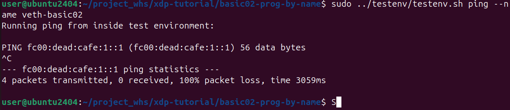

# XDP-Tutorial 가이드라인

<!-- # [**XDP-Tutorial**](https://github.com/xdp-project/xdp-tutorial)
   - **설명**: eXpress Data Path의 기본적인 이해를 위한 튜토리얼 및 예제 모음.
   - **특징**: XDP의 동작 및 개발 방법에 대한 이해 촉진.
   - **장단점**:
     - **장점**: XDP 프로그래밍에 대한 학습에 유용한 자원 제공.
     - **단점**: 고급 사용자에게는 부족한 수준일 수 있음.
   - **설치 가이드**: 프로젝트의 GitHub 페이지 또는 문서를 따라 설치. -->

## 실습 환경 구성[\(Setup dependencies\)](https://github.com/xdp-project/xdp-tutorial/blob/master/setup_dependencies.org)
Docker 환경(Ubuntu 22.04, 24.02)에서 실습 환경을 구성하려 했으나, make 명령이 정상적으로 실행되지 않았음.
따라서 vmware로 만든 가상머신(Ubuntu 24.04)에서 실습 환경을 구성함.

1. 종속성 설치
```
sudo apt install -y git
sudo apt install -y clang llvm libelf-dev libpcap-dev build-essential libc6-dev-i386
sudo apt install -y linux-tools-$(uname -r)
sudo apt install -y linux-headers-$(uname -r)
sudo apt install -y linux-tools-common linux-tools-generic
sudo apt install -y tcpdump
```

2. git clone
```
git clone --recurse-submodules https://github.com/xdp-project/xdp-tutorial.git
```

## 실습
AF_XDP를 사용하기 위한 목적이므로, xdp-tutorial의 basic01, 02, 03과 advanced03 AF_XDP만 이용한다.

## basic01 xdp pass
이 단계의 목적은 xdp를 로드하는 방법으로 3가지와 XDP가 동작중인지를 확인하는 것을 알려준다.

### iproute2 ip
  - 로드
  `sudo ip link set dev lo xdpgeneric obj xdp_pass_kern.o sec xdp`

  - 확인
  `sudo ip link show`
  [iproute2_load_check](./img/iproute2_load_check.png)

  - 제거
  `sudo ip link set dev lo xdpgeneric off`

### xdp-loader
  - 로드
  `sudo xdp-loader load -m skb lo xdp_pass_kern.o`

  - 확인
  `sudo xdp-loader status lo`
  [xdp_load_check](./img/xdp_load_check.png)

### xdp_pass_user
  - 로드
  `sudo ./xdp_pass_user --dev lo`

  - 확인
  ```
  sudo ip link list dev lo
  sudo bpftool net list dev lo
  sudo xdp-loader status lo
  ```
  [bpftool_load_check](./img/bpftool_load_check.png)

  - 제거
  \[ID\]만 제거
  `sudo ./xdp_pass_user --dev lo -U [ID]`

  전부 제거
  `sudo ./xdp_pass_user --dev lo --unload-all`

## basic02 prog by name
이 단계의 목적은 둘 이상의 XDP 프로그램이 있을 때, 하나를 고르는 법을 알려주는 것이다.

`xdp_prog_kern.c`에는 XDP_PASS와 XDP_DROP을 수행하는 두 프로그램이 담겨있다.
```
SEC("xdp")
int  xdp_pass_func(struct xdp_md *ctx)
{
	return XDP_PASS;
}

SEC("xdp")
int  xdp_drop_func(struct xdp_md *ctx)
{
	return XDP_DROP;
}
```

`sudo ./xdp_loader --dev veth-basic02 --progname xdp_drop_func`로 XDP_DROP 프로그램을 실행하면, 보낸 ping이 모두 버려지는 것을 볼 수 있다.


그리고 `sudo ./xdp_loader --dev veth-basic02 --progname xdp_pass_func`로 XDP_PASS 프로그램을 실행하면 아까와 다르게 정상적으로 수신된다.


## basic03 map counter
## advanced03 AF_XDP