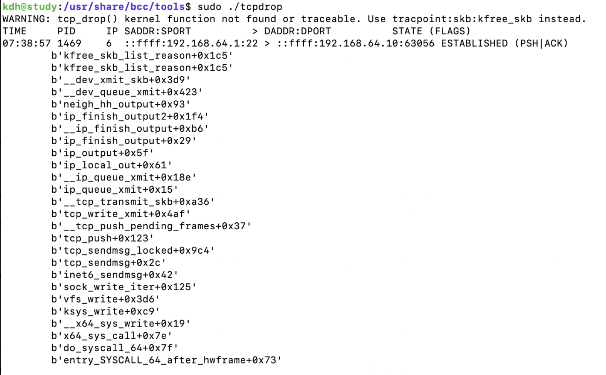
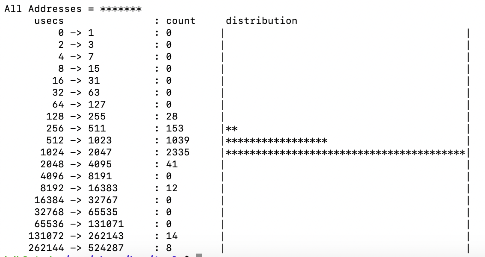

## 사용방법
도구들은 모두 /usr/share/bcc/tools/ 경로상에 있다.

#### 1. `**tcpaccept**` - TCP 연결이 수락될 때 발생되는 이벤트를 추적한다. 네트워크 서비스의 연결 수락 성능을 분석할 수 있다.
   ex)

#### 2. `**tcpconnlat**` - TCP 연결 설정 지연을 측정한다. 지연 시간을 포착하여 네트워크 연결의 성능 문제를 진단할 수 있다.
   ex) 1.79ms의 지연을 알 수 있다.
   
#### 3. `**tcpretrans**` - TCP 재전송을 모니터링하여 네트워크 신뢰성 문제를 식별한다. 
   ex) 패킷 손실이나 네트워크 혼잡 때문에 발생하는 재전송을 추적하여 네트워크 안정성을 평가할 수 있다.
   
#### 4. `**tcpsubnet**` - 특정 서브넷 내에서 TCP 트래픽을 분석한다. 특정 영역의 트래픽 패턴을 이해하는데 유용하다.
   ex) nc -l 옵션으로 hello를 치면 ip주소와 함께 서브넷 마스크가 뜨며, TCP 연결 or 트래픽 수가 나타난다.
   
     
#### 5. `**tcptracer**` - TCP 세션을 추적하고 각 연결의 경로를 시각화한다. 네트워크 경로 문제나 최적화할 수 있는 부분을 찾는데 사용된다.
   ex) 여기서 T(TCP), C는 connected를 의미하며, X는 closed를 의미한다.
   그리고 PID, COMM, IP버전, Sourc IP, Destination IP, Source port, Destination IP가 출력이 된다.
  
   
#### 6. `**tcpcong**` - TCP 혼잡 제어 알고리즘의 동작을 모니터링한다. 
   ex) 네트워크 혼잡상태, 혼잡 제어 메커니즘이 어떻게 반응하는지 관찰하는지 확인 할 수 있다.
#### 7. `**tcpdrop**` - 드롭되는 TCP 패킷을 추적한다.(드롭이 발생할 수 있는 지점 보여줌)
   ex) 패킷들을 추적하고 있으며, 드롭이 발생할 수 있는 지점들을 보여준다.
#### 8. `**tcprtt**` - TCP의 RTT 측정한다. (지연시간 측정)
   ex) usecs : RTT의 시간 범위를 마이크로초로 나타낸다.
   count : RTT 범위에 해당하는 TCP 연결 수이다.
   distribution : RTT를 시각적으로 표현한다.
   
#### 9. `**tcpsynbl**` - SYN 백로그가 가득 찼을 때 상황을 모니터링한다.
#### 10. `**tcplife**` - TCP 연결의 수명과 통계를 모니터링한다.
ex) TX_KB : 전송된 데이터 양
	RX_KB : 수신된 데이터 양
    MS : 연결 지속 시간

#### 11. `**tcpstates**` - TCP 연결 상태의 변화를 추적한다.
ex) OLDSTATE -> NEWSTATE : TCP 연결의 이전 상태에서 새로운 상태를 보여준다.
    SYN_SENT->ESTABISHED->FIN_WAIT1->CLOSE : tcp 연결 과정을 보여준다.
    
#### 12. `**tcptop**` - 실시간 TCP 트래픽을 모니터링하여 각 연결의 성능을 보여준다. 
ex) tcp의 현재 상태를 보여주며, 사진에서는 ssh 연결이 8시간동안 되어있다는 것을 알 수 있다.
