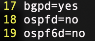

**설치방법**
```
curl -s https://deb.frrouting.org/frr/keys.gpg | sudo tee /usr/share/keyrings/frrouting.gpg > /dev/null

FRRVER="frr-stable"
echo deb '[signed-by=/usr/share/keyrings/frrouting.gpg]' [https://deb.frrouting.org/frr](https://deb.frrouting.org/frr) \
     $(lsb_release -s -c) $FRRVER | sudo tee -a /etc/apt/sources.list.d/frr.list
     
sudo apt update && sudo apt install frr frr-pythontools
```

**BGP 설정방법**
```
cd /etc/frr/daemons
sudo vi daemons (bgpd=no를 yes 로 변경)
sudo systemctl restart frr
```


**BGP 기본 설정**
```
sudo vtysh
configure terminal
router bgp <AS 번호 설정>
bgp router-id <BGP 라우터 ID 설정>
```

**BGP 프로세스 시작**
```
router bgp <AS번호>
```

**세션 모니터링**
```
show bgp summary
show ip bgp neighbors <IP주소>
```

**BGP 라우팅 테이블 조회**
```
show ip bgp 
show ip bgp <IP주소/서브넷 마스크>
```

**BGP 이웃 설정**
```
neighbor <IP주소> remote-as <peer AS 번호>
```

**BGP 세션을 위한 주소나 인터페이스 지정**
```
neighbor <IP주소> update-source <IP 주소 / Interface 주소>
```

**eBGP를 위해 여러 홉을 거치는 것을 허용**
```
neighbor <IP주소> ebgp-multihop <hop>
```

**BGP 암호 설정**
```
neighbor <IP주소> password <PASSWORD>
```

**이웃에게 속성 전송 여부**
```
neighbor <IP주소> send-community <TYPE>
```
 - 타입종류
	standard - 표준
	extended -  확장된 커뮤니티만 전송
	both - 모두 전송

**라우팅 정보 전파**
```
network <IP주소/서브넷 마스크>
```

**경로 재분배**
```
redistribute <프로토콜>
```

**여러 경로를 하나의 경로로 집계하여 전파**
```
aggregate-address <IP주소/서브넷 마스크>
```

**라우터 맵 및 정책 적용**
```
route-map <name> permit|deny <number>
```

**AS 경로 필터링**

```
ip as-path access-list <리스트 이름> permit|deny <AS 경로 표현식> router bgp <AS번호> 
neighbor <IP주소> filter-list <리스트 이름> in|out
```
