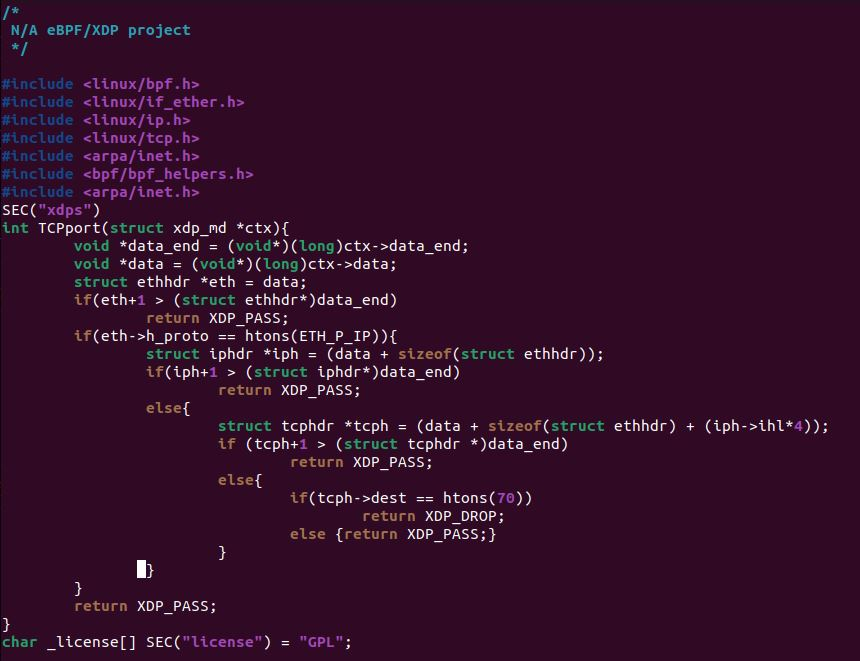
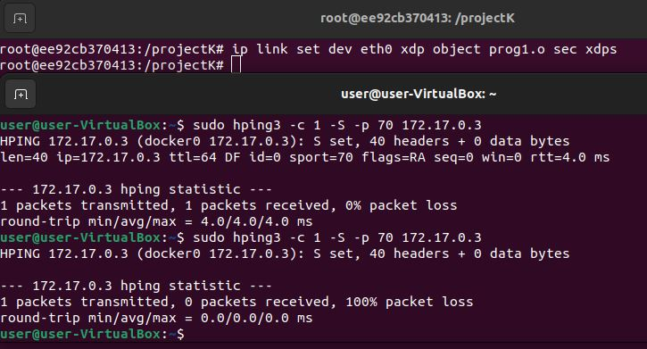

***

##### XDP FIREWALL 및 XDP 오픈소스 프로그램들을 참고하여 다양한 예제를 만들어본다.

## Deny TCP port 70

	학습내용 : ethernet header, ip header, TCP header 를 어떻게 표시하는지 학습하며, 각 프로토콜의 기본적인 구조체를 활용하여 TCP 프로토콜의 포트 70번 패킷 진입을 차단한다.
		1. bpf.h bpf_helpers.h 등 핵심 헤더파일의 역할에 대해 학습한다.
		2. if_ether.h ip.h tcp.h 와 같은 각 프로토콜 별 헤더파일에 들어있는 구조체들에 대해 이해한다.
###### 코드

###### 결과

최초 작성일 : 2024-05-10 
