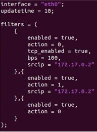
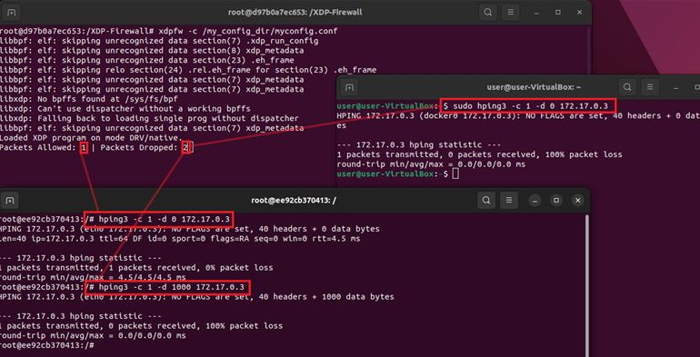
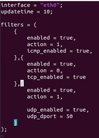
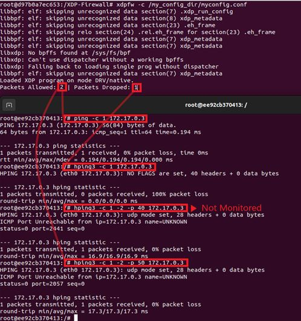

***

### Intro.
###### 필터링 규칙을 사용자가 직접 커스터마이징하고 XDP-FIREWALL 명령어를 통해 간편하게 XDP 프로그램을 XDP Hook 에 연결할 수 있으며 최종적으로 실행시킬 수 있다.

***
#####      command
		—-config –c : config 파일의 위치를 지정할 수 있다. 
				( 기본 위치 /etc/xdpfw/xdpfw.conf ) 
		—-offload –o : 직접 오프로드를 할 수 있게 만들기 위한 명령어이다. 
		—-skb –s : 소켓 버퍼에 프로그램을 로드하게 한다. 
		—-time –t : 실행 후 프로그램을 얼마나 지속시킬 것인지 설정한다. 
		—-list –l : config 파일에서 적용된 필터링 규칙들을 나열한다. 
		--help –h : 위 리스트를 출력한다.

### Config File

####       Options
#####                Main
			 interface : NIC 이름을 적으면 된다. 
				  ip a 또는 ls /sys/class/net처럼 다양한 방법을 통해 
				  알 수 있다. 
			 updatetime : config 자동 업데이트 시간을 정한다. 
			 nostats : 추가 설정이 없으면 패킷 통계를 보여주지만, 
				   true일 경우 생략한다.
#####                Filters
			 enabled : rule 작동 여부를 결정한다. 
				 true 로 바꿔야 작동한다.
			 action : 패킷에 대한 동작 수행으로 2가지가 있다. 
				 Block(0), Allow(1) 
			 srcip / dstip : ipv4 주소 기입 
			 srcip6 / dstip6 : ipv6 주소 기입 
			 min_ttl : 최소 TTL 
			 max_ttl : 최대 TTL 
			 max_len : 최대 Frame data 길이 
			 min_len : 최소 Frame data 길이 
			 tos : 사용자는 원하는 Type Of Service Flag 가 맞는지 
				 지정할 수 있다. 
					tos? : 하단 링크 참고 
<http://www.ktword.co.kr/test/view/view.php?m_temp1=2051>
				

			 pps : Source IP 마다 필터링 정책 적용 전에 보낼 수 있는 
				 초당 최대 패킷 수 
			 bps : Source IP 마다 필터링 정책 적용 전에 보낼 수 있는 
				 초당 최대 패킷 크기 
			 blocktime : Block 시간을 따로 설정할 수 있다
			- TCP
				tcp_enabled : TCP 필터링 동작 여부 
				tcp_sport : Source Port 필터링 
				tcp_dport : Destination Port 필터링 
				tcp_urg : 패킷의 URG 플래그 필터링 
				tcp_ack : 패킷의 ACK 플래그 필터링 
				tcp_rst : 패킷의 RST 플래그 필터링 
				tcp_psh : 패킷의 PSH 플래그 필터링 
				tcp_syn : 패킷의 SYN 플래그 필터링 
				tcp_fin : 패킷의 FIN 플래그 필터링 
				tcp_ece : 패킷의 ECE 플래그 필터링 
				tcp_cwr : 패킷의 CRW 플래그 필터링
			- UDP
				 udp_enabled : TCP 필터링 동작 여부
				 udp_sport : Source Port 필터링
				 udp_dport : Destination Port 필터링
			- ICMP
				icmp_enabled : ICMP 필터링 동작 여부 
				icmp_code : ICMP Code 필터링 
				icmp_type : ICMP Type 필터링 
					code & type : 하단 링크 참고
     
<https://www.iana.org/assignments/icmp-parameters/icmp-parameters.xhtml>

### XDP-FIREWALL Command  
		a. Config File 위치 강제 조정(-c) 
		b. 드라이버 이름 삽입 (interface) 
		c. 통계치 출력 조작(nostats true/false) 
		d. 내부 필터링 규칙 구현 
		e. 필터링 규칙 확인(-l) 
		f. 프로그램 실행 > 기본 실행 명령어 사용 > offload 명령어 사용(-o)
#####         TIPS
		- 정책 구간({} 중괄호 내용 의미)마다 ICMP, TCP, UDP가 표시됐는데, 
			특정 동작을 요구할 경우, 똑같은 프로토콜의 정책 {구간} 을 생성하지
			않으면 실제로 모니터링에서 제외된다. (즉, 한번 제어할 수 있는 구간
			을 만들어 놓았다면, 같은 프로토콜의 enabled 구간을 하나 더 만들
			어야 한다)
		 - "-l" 해당 명령어는 Default 경로에 대한 Filtering List를 나열한다.
		 - "-c" 적용시킬 정책을 포함해서 명령어를 작성하면 된다. 
			 Default : xdpfw (-> /etc/xdpfw/xdpfw.conf 참고) 
			 usage : xdpfw –c /my_file/my_xdp.conf
### Analysis
#####         예제1
		목적 : 특정 프로토콜(TCP) 로부터 오는 패킷을 bps를 설정해서 막아보자. 
		정책 구성 : 
			(1) 지정한 Source IP를 제외한 다른 사용자 접근시 XDP_DROP 
			(2) bps 100, 총 데이터 100Byte 까지만 XDP_PASS

				
		실행 과정 :
			(1) Host에서 xdpfw docker container(172.17.0.3)로 패킷 전달, -> 차단 
			(2) docker container(172.17.0.2)에서 xdpfw docker container(172.17.0.2) 로 
				 data=0Byte로 TCP 패킷 전달 -> XDP_PASS 
			(3) docker container(172.17.0.2)에서 xdpfw docker container(172.17.0.2) 로
				 data=1000Byte로 TCP 패킷 전달 -> XDP_DROP 
		결과 이미지:
  
	
#####         예제2
		목적 : ICMP 패킷은 PASS, TCP 패킷은 DROP, UDP 패킷은 포트번호 50 PASS
		정책 구성 : 
			(1) ICMP 패킷 PASS 
			(2) TCP 패킷 DROP
			(3) UDP 패킷 PORT 50 PASS 
				- port 50번이 아닌 udp 같은 경우에, 표시되지 않는다.

	
		실행 과정 :
			- From docker container(172.17.0.2) To xdpfw docker container(172.17.0.3)
			- (1) ICMP (172.17.0.2) → (172.17.0.3) : PASS 
			- (2) TCP (172.17.0.2) → (172.17.0.3) : DROP 
			- (3) UDP port 40 (172.17.0.2) → (172.17.0.3) : Not Monitored 
			- (4) UDP port 50 (172.17.0.2) → (172.17.0.3) : PASS
		결과 이미지:
				

    
